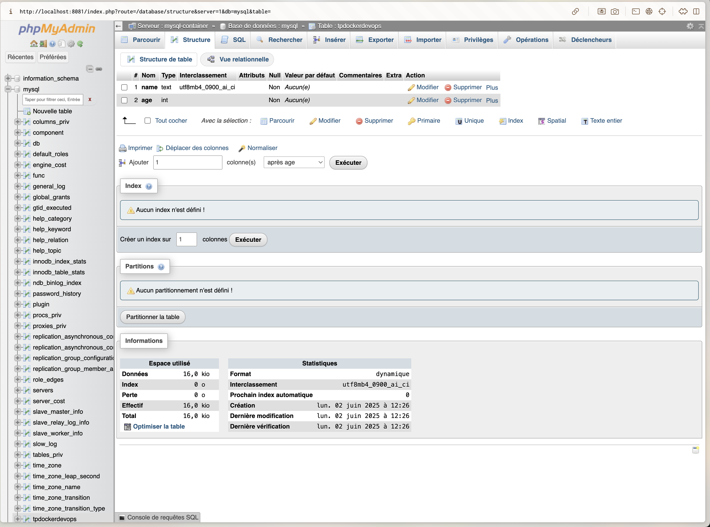

# docker_DEVOPS

Thomas PIET

3.a -> docker pull nginx
  
  b -> docker images | grep nginx (docker images pour voir toutes les images que j'ai et grep nginx pour rechercher la ligne nginx)

  c -> mkdir -p ./html && touch ./html/index.html 

  d -> docker run --name my-nginx -p 8080:80 -v $(pwd)/html:/usr/share/nginx/html -d nginx

  e -> docker stop my-nginx && docker rm my-nginx

  f -> docker run --name my-nginx -p 8080:80 -d nginx && docker cp ./html/index.html my-nginx:/usr/share/nginx/html/index.html

4.b -> docker build . -t my-nginx

  c -> Je remarque que c'est plus rapide pour tester en environnement dev d'utiliser l'exemple 4. Je pense que l'environnement avec le Dockerfile est plus approprié pour de la prod.

5.a -> docker network create shit-network
      
       docker run --name mysql-container --network shit-network -e MYSQL_ROOT_PASSWORD=my-secret-pw -d mysql:8.0

       docker run --name my-phpmyadmin --network shit-network -e PMA_HOST=mysql-container -p 8081:80 -d phpmyadmin/phpmyadmin  (port 8081 car le port 8080 est déjà utilisé par le site en 8080	)

  b -> 

6. a -> Le docker compose permet de lancer de parametré et de lancer plusieurs conteneurs via un seul fichier. il suffit de tout paramétrer dans un fichier et il faut une commande pour le lancer.
   
   b -> Pour lancer : docker-compose up -d
	Pour stopper : docker-compose down
